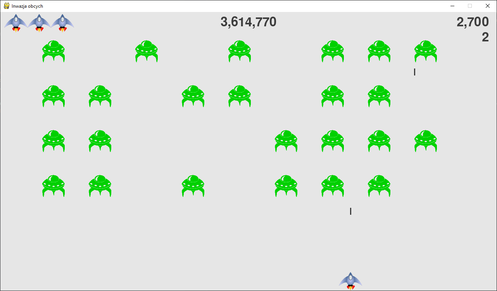

## Alien Invasion

Prosta gra, w której zadaniem gracza jest zestrzeliwanie obcych. Z każdym poziomem wzrasta tempo 
rozgrywki. Gra wykorzystuje bibliotekę Pygame i powstała przy udziale książki _Python. Instrukcje 
dla programisty_ (_Python Crash Course_) autorstwa Erica Matthesa (z modyfikacjami). 
Projekt używa Pythona 3.8.

### Instalacja i uruchomienie
1. ściągnąć pliki do wybranego folderu
2. przejść w konsoli do folderu z grą
3. `python -m pip install --user pygame==1.9.6` w celu zainstalowania Pygame (v 1.9.6)
4. `python alien_invasion.py`

(jeśli mamy również zainstalowanego Pythona w wersji 2.x to polecenie `python` należy zastąpić `python3`)

### Sterowanie
- przełączanie na tryb pełnoekranowy: `F` (możliwe tylko zanim rozpoczniemy nową grę)
- rozpoczęcie nowej gry: `G` lub kliknać w `Nowa gra`
- zamknięcie gry: `ESC`
- poruszanie statkiem na boki: strzałki `🠈` `🠊`
- strzelanie: `spacja`
- punktacja:
    - prawy górny róg: aktualny wynik i poziom
    - na środku na górze: najlepszy wynik zdobyty dotychczas w grze
    - lewy górny róg: ilość pozostałych statków (gracz ma 3 życia w każdej nowej grze)

